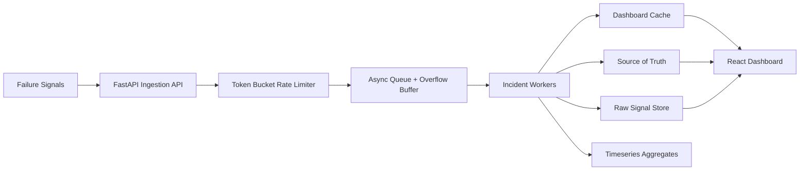

<<<<<<< HEAD
# Incident Management System (IMS)

Mission-Critical Incident Management System for Zeotap's Infrastructure / SRE internship assignment.

## What is included

- `backend/`: FastAPI async ingestion engine with debouncing, alerting strategies, RCA validation, retry logic, and throughput logging.
- `frontend/`: React/Vite dashboard for live incident tracking and RCA submission.
- `docker-compose.yml`: Local development stack for the full application.
- `scripts/`: Sample failure stream and replay helper.
- `docs/` and `prompts/`: Architecture, backpressure, testing notes, and creation notes checked into the repository.

## Architecture



The backend accepts signals asynchronously, debounces repeated component failures within a 10 second window, and creates one work item per burst. RCA is mandatory before an incident can be closed. The frontend polls active incidents and lets a reviewer inspect raw signals and submit RCA details.

## Tech Stack

- Backend: Python 3.11, FastAPI, Pydantic
- Frontend: React 18, Vite, TypeScript
- Testing: pytest, React Testing Library, Vitest
- Containerization: Docker Compose

## Setup with Docker Compose

1. Build and run the stack:

```bash
docker compose up --build
```

2. Open the services:
- Backend API: http://localhost:8000
- Health check: http://localhost:8000/health
- Frontend: http://localhost:5173

3. Seed a sample incident stream:

```bash
python scripts/seed_failure_stream.py
```

## Local development

Backend:

```bash
cd backend
python -m pip install -e .
uvicorn app.main:app --reload
```

Frontend:

```bash
cd frontend
npm install
npm run dev
```

## Testing

Backend:

```bash
cd backend
pytest
```

Frontend:

```bash
cd frontend
npm test
```

## Load Test Evidence

A reproducible load-test script is available at `scripts/load_test.py`.

Run against the Dockerized stack:

```bash
python scripts/load_test.py --total 10000 --concurrency 200
```

Observed sample output on this machine:

```json
{
    "total_requests": 10000,
    "concurrency": 200,
    "duration_seconds": 44.062,
    "request_throughput_per_sec": 226.95,
    "accepted": 10000,
    "rate_limited": 0,
    "failed": 0
}
```

Backend throughput metric samples from container logs:

```text
[IMS] throughput=116.00 signals/sec queue=0 overflow=0
[IMS] throughput=8.80 signals/sec queue=0 overflow=0
```

Note: The assignment burst target (10,000 signals/sec) is an architecture/scalability objective. Achievable throughput depends on host resources and deployment topology; local laptop runs provide indicative evidence but not a production ceiling.

## Backpressure handling

Backpressure is handled in the ingestion path instead of the UI path. The API uses a token-bucket limiter to reject overload early, the worker queue is bounded, and overflow traffic is parked temporarily in memory until workers catch up. Console throughput metrics print every 5 seconds so you can observe the queue draining under load.

## Validation rules

- A Work Item cannot move to `CLOSED` unless the RCA object is complete.
- MTTR is calculated from the RCA incident start and end timestamps.
- The live feed is sorted by severity.
- The dashboard detail view exposes the raw signals linked to the incident.

## Bonus points implemented

- Request rate limiting on ingestion.
- Async queueing with overflow protection.
- Retry wrapper for persistence writes.
- Throughput metrics in the console.
- A dedicated sample failure stream script.

## Requirement Mapping

For a complete requirement-by-requirement implementation and test mapping, see:

- docs/requirements-traceability.md

For a one-page PDF-ready submission narrative, see:

- docs/pdf-submission-summary.md

## Submission note

Before submitting the final PDF, replace the placeholder repository URL with your actual GitHub link if needed and export the completed report as:

`Full Name - Infrastructure / SRE Intern Intern Assignment.pdf`
=======
# Incident-Management-System-IMS-
>>>>>>> be87adc3049809fb75276adffa957b7c37f73bb1
