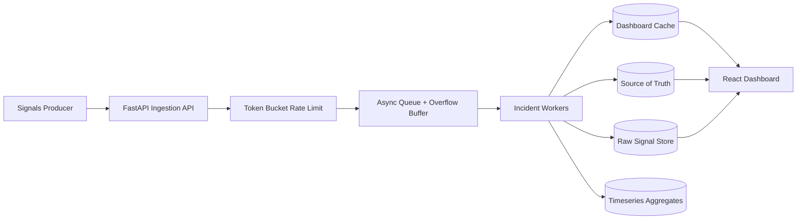

# Architecture

The IMS uses a queue-first ingestion path so the public API remains responsive when downstream stores slow down.

Design choices:

- Signals are accepted asynchronously and drained by workers.
- Debouncing is keyed by `component_id` with a 10 second window.
- Alert severity is selected through a strategy registry.
- Work item lifecycle uses explicit state transitions.
- RCA validation happens before an incident can be closed.
- Raw signals are separated from structured incident records.
